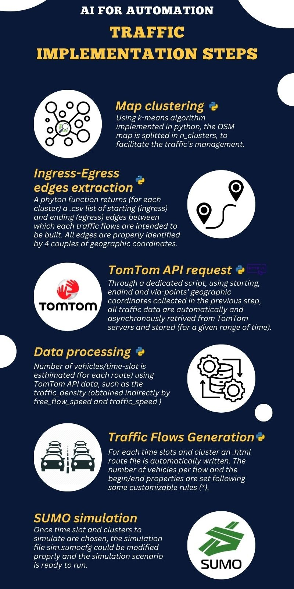
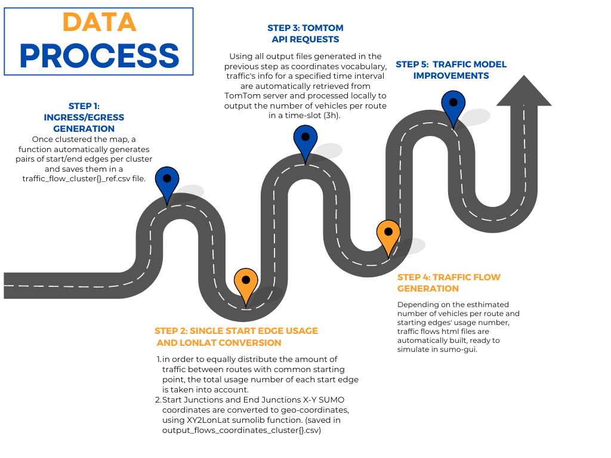

# AI For Automation

Scripts:  
- `tomtom_api.py`: contiene un client per le api REST di TomTom
- `processor.py`: processore che elaborata i dati di traffico di tom tom
- `route_analysis.ipynb`: file jupyter con le elaborazioni

| Funzione                         | Descrizione                                                                                       | Parametri Input                                                                                       |
|-----------------------------------|---------------------------------------------------------------------------------------------------|--------------------------------------------------------------------------------------------------------|
| `load_map(file_path)`             | Carica una mappa XML SUMO, estraendo giunzioni e restituendo un array con le loro coordinate.      | `file_path` (str): il percorso del file XML da caricare.                                                |
| `cluster_junctions(junctions, n_clusters)` | Applica il clustering K-Means sulle giunzioni della mappa. Restituisce le etichette dei cluster e i centroidi. | `junctions` (np.array): array di coordinate delle giunzioni; `n_clusters` (int): numero di cluster da generare. |
| `convert_to_geographic(centroids, net)` | Converte le coordinate SUMO (x, y) in coordinate geografiche (latitudine, longitudine).          | `centroids` (list): lista di centroidi in coordinate SUMO; `net` (oggetto SUMO): la rete SUMO caricata. |
| `is_valid_route(from_edge, to_edge, net)` | Verifica se esiste un percorso valido tra due edge della mappa.                                   | `from_edge` (str): ID dell'edge di partenza; `to_edge` (str): ID dell'edge di arrivo; `net` (oggetto SUMO): la rete SUMO caricata. |
| `is_edge_allowed_for_vehicle(edge, vehicle_type)` | Verifica se un veicolo di un determinato tipo può percorrere un edge.                            | `edge` (dict): dati relativi all'edge (ID, veicoli ammessi, ecc.); `vehicle_type` (str): tipo di veicolo da controllare. |
| `generate_ingress_egress_per_cluster(edges_by_cluster, junction_clusters, net, vehicle_type='passenger')` | Genera ingressi e uscite di traffico per ciascun cluster e li salva in un file CSV.              | `edges_by_cluster` (dict): dizionario con gli edge per cluster; `junction_clusters` (list): etichette dei cluster per le giunzioni; `net` (oggetto SUMO): la rete SUMO caricata; `vehicle_type` (str): tipo di veicolo (default: 'passenger'). |
| `find_border_junctions(root)`     | Identifica le giunzioni ai margini della mappa in base alle connessioni tra gli edge.             | `root` (XML root element): radice dell'albero XML della mappa.                                          |
| `plot_clusters_and_edges(junctions, labels, edges, centroids, geographic_centroids, border_edges, all_cluster_border_edges, output_file)` | Esegue il plotting della mappa con i cluster, le giunzioni e i bordi evidenziati.                 | `junctions` (list): coordinate delle giunzioni; `labels` (list): etichette dei cluster; `edges` (list): lista degli edge; `centroids` (list): centroidi dei cluster; `geographic_centroids` (list): centroidi in coordinate geografiche; `border_edges` (list): edge di confine tra cluster; `all_cluster_border_edges` (list): edge di confine della mappa; `output_file` (str): percorso di salvataggio dell'immagine risultante. |
